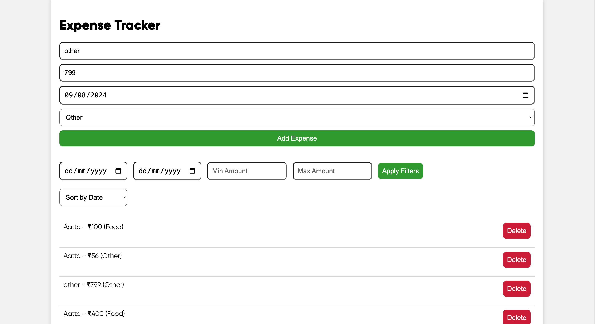
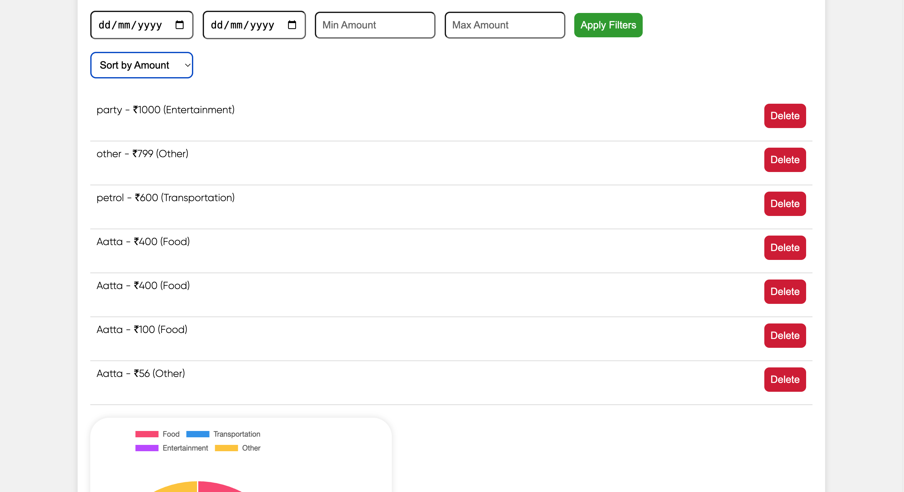
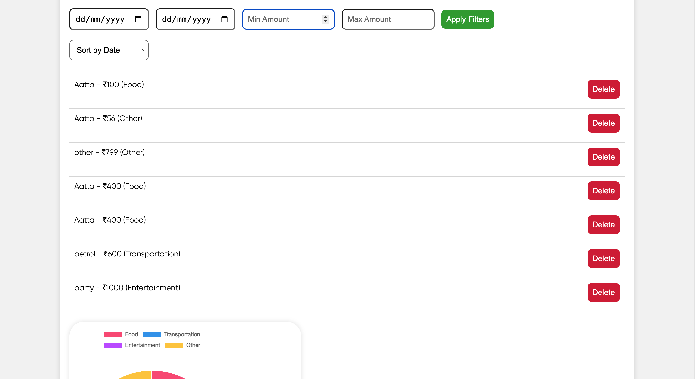
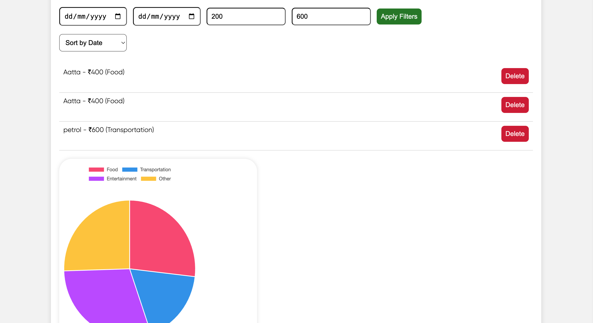
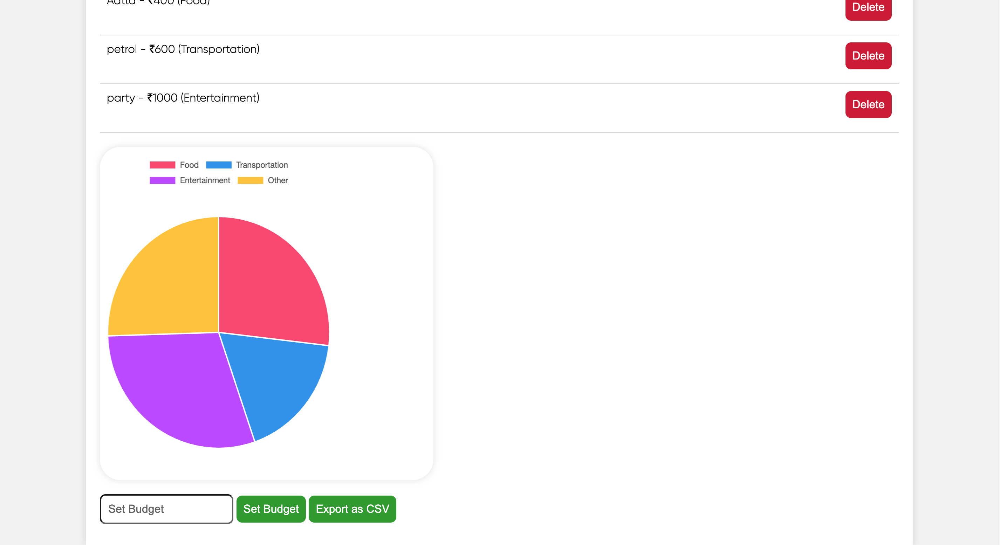
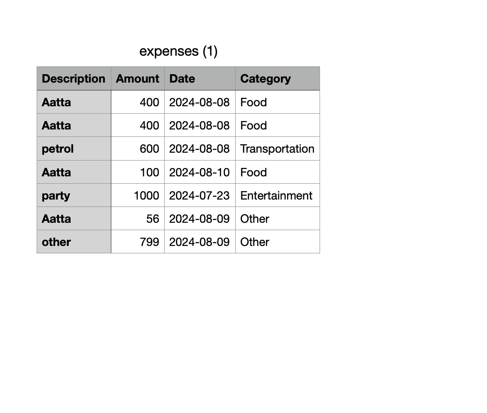

# Expense Tracker

## Overview

Welcome to the **Expense Tracker**! This web application helps you manage and visualize your expenses with an intuitive user interface. Built with modern web technologies, it features expense tracking, filtering, sorting, and visual representation of your data through interactive charts. 

### Key Features

1. **User-Friendly Interface**
   - **Form Submission**: Easily add new expenses with details like description, amount, date, and category using the form.
   - **Full-Screen View**: The application is designed to be responsive, utilizing the full screen for a better user experience.
  
   

2. **Expense Management**
   - **Add Expenses**: Input expenses and categorize them to keep track of various spending areas.
   - **Delete Expenses**: Remove any unwanted entries directly from the expense list.
  


  
3. **Filtering and Sorting**
   - **Date Range Filters**: Filter expenses by selecting a date range to view only relevant entries.
   - **Amount Range Filters**: Specify minimum and maximum amounts to focus on specific spending ranges.
   - **Sorting Options**: Sort expenses by date, amount, or category for easy analysis.
  
     **Before Filtering


    **After Filtering


5. **Visual Analytics**
   - **Chart Representation**: View your expenses categorized by type using a dynamic pie chart. The chart automatically updates to reflect the latest data.
  


6. **Budget Tracking**
   - **Set Budget**: Define a budget limit to track how much of your budget has been spent and how much remains.
   - **Budget Summary**: View a summary of your budget, total spent, and remaining balance.

7. **CSV Export**
   - **Export Data**: Export your expense data to a CSV file for further analysis or record-keeping.
  


### How It Works

1. **Form Submission**
   - Users enter the expense details in the form fields (description, amount, date, and category) and submit the form. The expense is then added to the list and stored in the local storage.

2. **Expense Storage**
   - Expenses are stored in the browser’s local storage. This allows data to persist across page reloads.

3. **Displaying Expenses**
   - Expenses are displayed in a list format. Users can see the description, amount, date, and category of each expense. Each item also includes a delete button.

4. **Updating the Chart**
   - The pie chart updates automatically when new expenses are added or when filters and sorting options are applied. The chart reflects the total amounts spent in each category.

5. **Filtering and Sorting**
   - Users can apply filters and sorting options to refine the displayed expenses. Filters adjust the expense list based on date and amount ranges, while sorting organizes the list according to the selected criteria.

6. **Budget Management**
   - Users can set a budget limit, which is saved in local storage. The application calculates and displays the total spent, remaining budget, and provides an overview of the budget status.

7. **CSV Export**
   - Users can export their expense data as a CSV file, making it easy to share or analyze the data using other tools.

### Installation and Setup

1. **Clone the Repository**
   ```bash
   git clone https://github.com/yourusername/expense-tracker.git
   ```

2. **Navigate to the Project Directory**
   ```bash
   cd expense-tracker
   ```

3. **Open `index.html` in a Web Browser**
   - Simply open `index.html` in your preferred web browser to start using the application.

### Technologies Used

- **HTML**: Structure of the web application.
- **CSS**: Styling and layout of the application, including responsive design and modern UI elements.
- **JavaScript**: Application logic, including form handling, local storage management, and chart updates.
- **Chart.js**: A powerful library used to create the interactive pie chart.

### Contributing

Contributions are welcome! Please fork the repository and submit pull requests for any improvements or bug fixes.

### License
This project is licensed under the MIT License - see the [LICENSE](LICENSE) file for details.
